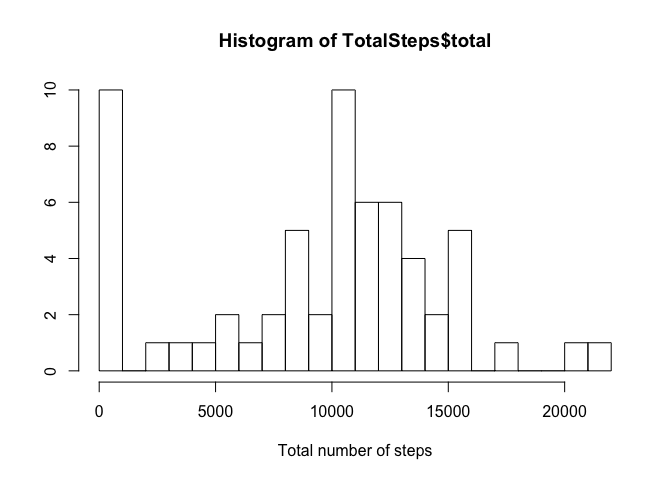
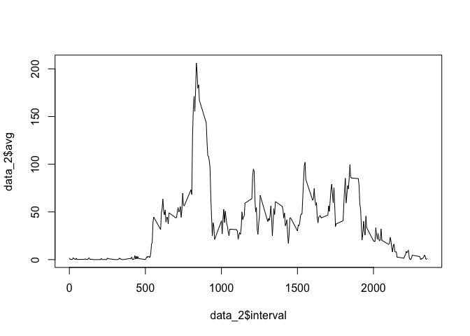
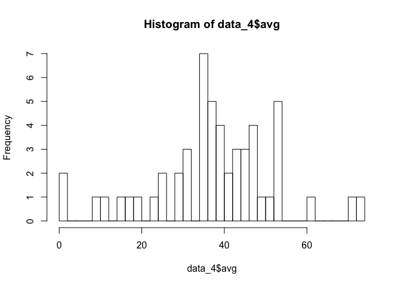
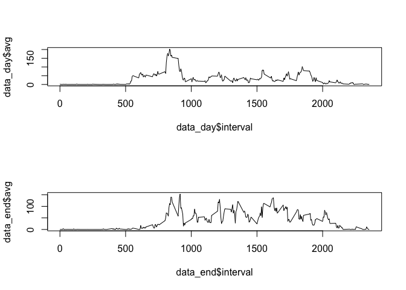

## Loading and preprocessing the data

```r
data <- read.csv(unz("activity.zip", "activity.csv"))
```


```r
head(data)
```

```
##   steps       date interval
## 1    NA 2012-10-01        0
## 2    NA 2012-10-01        5
## 3    NA 2012-10-01       10
## 4    NA 2012-10-01       15
## 5    NA 2012-10-01       20
## 6    NA 2012-10-01       25
```

#### convert date column from factor to date

```r
data$date <- as.Date(as.character(data$date))
```


## What is mean total number of steps taken per day?


```r
library(dplyr)
```

```
## 
## Attaching package: 'dplyr'
```

```
## The following objects are masked from 'package:stats':
## 
##     filter, lag
```

```
## The following objects are masked from 'package:base':
## 
##     intersect, setdiff, setequal, union
```

```r
TotalSteps <- data %>% group_by(date) %>% summarize(total = sum(steps, na.rm = TRUE))
```


```r
hist(TotalSteps$total, xlab = 'Total number of steps', ylab = '', breaks = 30)
```

<!-- -->

### average and median


```r
avg_and_med<- data %>% group_by(date) %>% summarize(avg = mean(steps, na.rm = TRUE), med = median(steps, na.rm = TRUE))
head(avg_and_med)
```

```
## # A tibble: 6 x 3
##         date      avg   med
##       <date>    <dbl> <dbl>
## 1 2012-10-01      NaN    NA
## 2 2012-10-02  0.43750     0
## 3 2012-10-03 39.41667     0
## 4 2012-10-04 42.06944     0
## 5 2012-10-05 46.15972     0
## 6 2012-10-06 53.54167     0
```


```r
mean(data$steps, na.rm = TRUE)
```

```
## [1] 37.3826
```


```r
median(data$steps, na.rm = TRUE)
```

```
## [1] 0
```

## What is the average daily activity pattern?


```r
data_2 <- data %>% group_by(interval) %>% summarize(avg = mean(steps, na.rm = TRUE))
plot(data_2$interval, data_2$avg, type = 'l')
```

<!-- -->


```r
data_2[data_2$avg == max(data_2$avg), ]$interval
```

```
## [1] 835
```


## Imputing missing values


```r
sum(is.na(data$steps))
```

```
## [1] 2304
```

impute with the average of interval 5


```r
data_3 <- data
data_3[is.na(data_3$steps), ]$steps <- data_2$avg[1]
```


```r
sum(is.na(data_3$steps))
```

```
## [1] 0
```


```r
data_4 <- data %>% group_by(date) %>% summarize(avg = mean(steps, na.rm = TRUE))
hist(data_4$avg, breaks = 30)
```

<!-- -->


```r
mean(data_3$steps)
```

```
## [1] 32.70514
```


```r
median(data_3$steps)
```

```
## [1] 0
```

the mean is slightly different, but the median is the same


## Are there differences in activity patterns between weekdays and weekends?


```r
data_3$type<- ifelse(weekdays(data_3$date)=="Saturday" | weekdays(data_3$date)=="Sunday", "Weekend", "Weekday")
head(data_3)
```

```
##      steps       date interval    type
## 1 1.716981 2012-10-01        0 Weekday
## 2 1.716981 2012-10-01        5 Weekday
## 3 1.716981 2012-10-01       10 Weekday
## 4 1.716981 2012-10-01       15 Weekday
## 5 1.716981 2012-10-01       20 Weekday
## 6 1.716981 2012-10-01       25 Weekday
```


```r
data_day <- data_3 %>% filter(type == 'Weekday') %>% group_by(interval) %>% summarize(avg = mean(steps))
data_end <- data_3 %>% filter(type == 'Weekend') %>% group_by(interval) %>% summarize(avg = mean(steps))
```


```r
par(mfrow=c(2, 1))
plot(data_day$interval, data_day$avg, type='l')
plot(data_end$interval, data_end$avg, type='l')
```

<!-- -->


